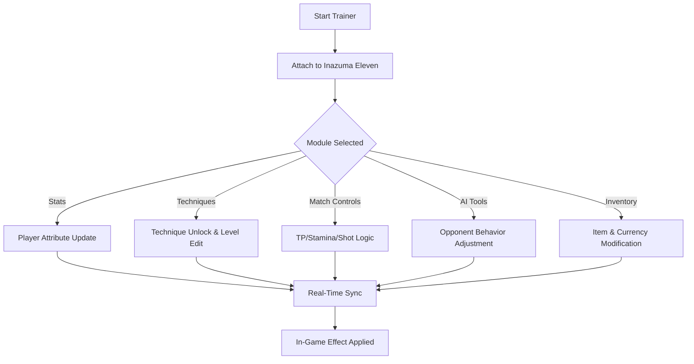

# Inazuma Eleven Trainer

Inazuma Eleven is a world where ambition becomes electricity,
where every kick feels like a pulse of destiny.
This trainer doesn’t replace that magic—
it simply gives you another instrument to play with,
letting you sculpt stats, tune energy, refine match pace,
and experiment with team dynamics in a fluid, reversible way.

Whether you want to breeze through story arcs, practice signature moves,
or sharpen AI behavior for training sessions,
the trainer offers a clean, intuitive interface with real-time effects and modular control.

---

## ⚡ Overview

This software acts as a **fully adjustable enhancement suite**, designed for:

* Player stat editing
* Technique and skill control
* Stamina/TP management
* Match boosters and momentum tweaks
* AI difficulty shaping
* Currency & item editing
* QoL transitions (skips, speed-up, automation)

Its goal is simple:
make your journey through Inazuma Eleven smoother, more experimental, and more expressive.

[!IMPORTANT]
All modules operate in memory-sandbox mode—changes are reversible and never overwrite original files unless you explicitly choose to save them.

---

## 🎮 Features

### Player Stat & Performance Tools

For fine-tuning team chemistry and role specialization.

* Kick, Speed, Dribble, Guard, Block stat edits
* Custom growth scaling for natural-feeling progression
* TP regeneration multiplier
* Stamina drain reducer or full stamina lock
* Unified templates (Striker Burst, Keeper Shield, Playmaker Flow)

### Technique & Skill Manager

Let every super-move gleam brighter.

* Unlock any technique instantly
* Modify technique level for better accuracy
* Reduce or remove TP consumption
* Toggle “Always Successful Special Techniques”
* Skill chaining booster for smoother combos

### Match Assistance Suite

Adjust the rhythm of the match like a conductor.

* Infinite Stamina / Infinite TP
* Increased shot success rate
* Pass critical rate multiplier
* Fatigue suppression
* Global team power-up toggle
* Match speed control (0.5×–3×)

### AI Training & Behavior Modifiers

Grow stronger through cleverly shaped practice.

* Opponent aggression slider
* AI accuracy multiplier
* Reaction delay toggle (for training difficulty modes)
* Formational rigidity controls
* Auto-adjust opponent stamina decay

### Inventory, Items & Resource Controls

Because time should never hold creativity hostage.

* Currency editor for coins & special items
* Item quantity adjustments
* Equipment unlocking
* Instant training materials
* Recruit-any-player panel

### Exploration & QoL Enhancements

Smoother journeys for story enjoyers and speedrunners.

* Skip cutscenes or dialogue blocks
* Fast-travel unlock
* Instant match restart
* Menu speed-up
* Clean HUD practice mode

---

## 🪟 Compatibility

| Component                    | Supported | Notes                                              |
| ---------------------------- | --------- | -------------------------------------------------- |
| Windows 10 / 11              | ✔️        | Optimized for 21H2+                                |
| Inazuma Eleven (PC/EMU)      | ✔️        | Compatible with common PC ports & emulation layers |
| High Refresh Rate Monitors   | ✔️        | Stable visual pacing                               |
| Controllers (Xbox/PS/Switch) | ✔️        | Overlay navigation included                        |

[!NOTE]
Accessibility presets include high-contrast UI, enlarged text, and simplified trainer layout.

---

## ⚡ Setup Guide

1. **Extract** the trainer package into a writable folder.
2. Run **InazumaTrainer.exe** as Administrator.
3. Select your mode:

   * **Story Mode Assist**
   * **Match Engine Boost**
   * **Training & AI Lab**
4. Attach to the game process—auto-detect enabled.
5. Open the in-game overlay using:

   ```
   F6
   ```
6. Toggle modules, adjust sliders, or enter manual values.

### Example Config (JSON)

```json
{
  "speed": 1.3,
  "kick_multiplier": 1.45,
  "infinite_stamina": true,
  "tp_regen": 2.2,
  "ai_reaction_delay": 0.25,
  "unlock_techniques": true
}
```

### Gentle Stat Upgrade Example

```json
{
  "speed": 1.1,
  "guard": 1.05,
  "tp_boost": 1.3,
  "clean_hud": true
}
```

---

## 🔁 Mermaid Diagram — Trainer System Flow



---

## 📝 Sample Presets

### ⚡ Striker Prime

A preset designed to sharpen offensive players.

```
kick = 1.55
shot_accuracy = 1.3
infinite_tp = false
tp_reduction = 0.6
enemy_aggression = 0.85
```

### 🌀 Midfield Control

For players who love tempo, passing, and flow.

```
speed = 1.25
dribble = 1.3
pass_crit = true
stamina_regen = 1.6
ai_accuracy = 0.7
```

### 🛡 Training Sandbox

For skill development and pattern practice.

```
enemy_reaction_delay = 0.4
enemy_accuracy = 0.5
infinite_stamina = true
clean_hud = true
time_scale = 0.75
```

---

## ❓ FAQ

### **Does this trainer affect saves?**

Only if you manually commit stat or inventory changes. Automatic backups protect your progress.

### **Does it support emulated versions?**

Yes—memory maps are optimized for common emulators.

### **Can I bind my own hotkeys?**

Every toggle and module supports custom bindings.

### **Does it run offline?**

Absolutely—no network access required.

### **How quickly do updates release?**

Minor patches are supported within hours; major version changes within 24–48 hours.

---

## 🌙 Final Thoughts

Lightning in your veins, wind in your stride—
that’s the promise of Inazuma Eleven,
a story where courage ignites the field and every kick becomes a spark.

This trainer does not replace that magic;
it simply expands the canvas,
letting you experiment with new tempos, refine your team’s glow,
and wander the leagues with a little more freedom in your fingertips.

Whether you’re practicing impossible shots,
exploring new formations,
or sculpting a dream roster—
let this tool be your silent coach, your rhythm keeper,
your spark in the storm.

---
